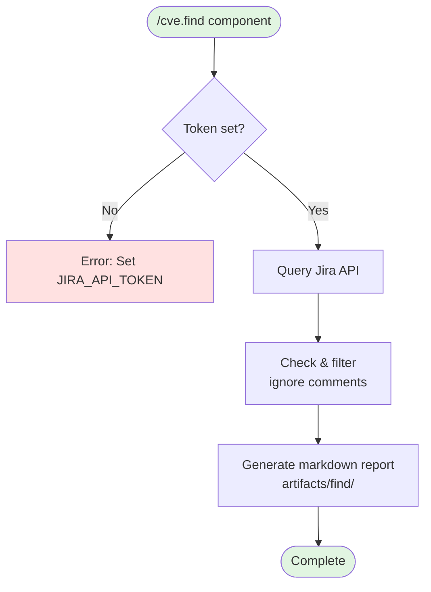
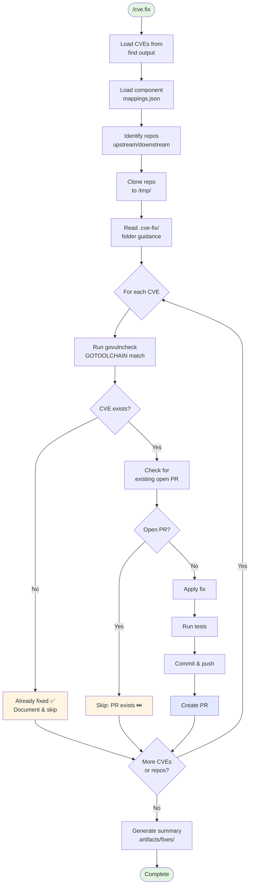

# CVE Workflow - Combined Flow

## CVE Find Workflow



## CVE Fix Workflow



## How to render this in PowerPoint:

### Option 1: Online Converter (Easiest)
1. Go to https://mermaid.live/
2. Paste the mermaid code above (between the ```mermaid``` tags)
3. Click **Actions** → **PNG** or **SVG**
4. Download the image
5. Insert into PowerPoint

### Option 2: VS Code Extension
1. Install "Markdown Preview Mermaid Support" extension
2. Open this file in VS Code
3. Press `Cmd+Shift+V` (Preview)
4. Right-click the diagram → Copy/Save

### Option 3: GitHub Render
1. Push this file to GitHub
2. View it in the browser (GitHub auto-renders mermaid)
3. Screenshot or use browser dev tools to export

### Option 4: Command Line (requires mmdc)
```bash
npm install -g @mermaid-js/mermaid-cli
mmdc -i cve-workflow-combined.md -o cve-workflow.png -b transparent
```
